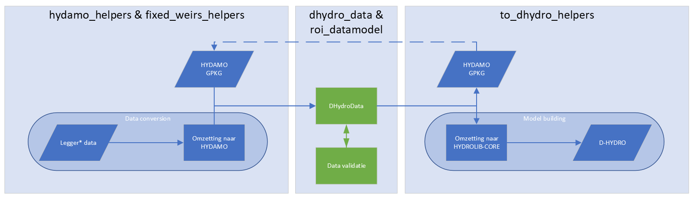

# ROI Toolbox
De ROI Toolbox is ontwikkeld binnen het Randstad Overstromingsmodel Instrumentarium (ROI) project.
Het doel van de Toolbox is om de dataconversie en modelbouw van overstromingsmodellen voor de Randstad te automatiseren.
Met deze Toolbox kunnen automatisch D-HYDRO overstromingsmodellen van de Randstad worden gegenereerd.

## Data
In onderstaande tabel staat beschreven welke geo-databronnen gebruikt zijn om de ROI modellen te bouwen.

| Data                                                                                                           | Bron                                                                                                                                                                                                                                                                                                                      |
|----------------------------------------------------------------------------------------------------------------|---------------------------------------------------------------------------------------------------------------------------------------------------------------------------------------------------------------------------------------------------------------------------------------------------------------------------|
| <ul><li>Binnendijkse hoofdwatergangen</li> <li>Locatie keringen</li><li> Objecten op hoodwatergangen</li></ul> | [NHI dataportaal](https://data.nhi.nu/): <ul><li>Waterschap Amstel, Gooi en Vechtstreek.</li></ul> Legger: <ul><li>[Hoogheemraadschap van Rijnland](https://www.rijnland.net/regels-op-een-rij/legger/),</li><li> [Hoogheemraadschap van Delfland](https://www.hhdelfland.nl/over-ons/regelgeving/legger/),</li><li> [Hoogheemraadschap van Schieland en de Krimpenerwaard](https://www.schielandendekrimpenerwaard.nl/wat-doen-we/regels-en-afspraken-over-beheer-keur-en-leggers/),</li><li> [Hoogheemraadschap de Stichtse Rijnlanden](https://www.hdsr.nl/werk/leggers-watergangen/).</li></ul> Rijkswaterstaat (ARK/NZK) |
| Rijntakken model                                                                                               | [Rijkswaterstaat](https://iplo.nl/thema/water/applicaties-modellen/modelschematisaties/rivieren/)                                                                                                                                                                                                                                                                                                       |
| Rijn Maasmonding model                                                                                         | [Rijkswaterstaat](https://iplo.nl/thema/water/applicaties-modellen/modelschematisaties/zuidwestelijke-delta/)                                                                                                                                                                                                                                                                                                          |
| Bodemhoogte                                                                                                    | [AHN4 DTM](https://www.ahn.nl/ahn-4)                                                                                                                                                                                                                                                                                                                  |
| Landgebruikskaart                                                                                              | Landgebruikskaart 2021 STOWA                                                                                                                                                                                                                                                                                              |
| Hoofdwegen                                                                                                     | [BGT TOP10NL](https://www.pdok.nl/introductie/-/article/basisregistratie-topografie-brt-topnl) Wegen                                                                                                                                                                                                                                                                                                         |
| Spoorwegen                                                                                                     | [BGT TOP10NL](https://www.pdok.nl/introductie/-/article/basisregistratie-topografie-brt-topnl) Spoorwegen                                                                                                                                                                                                                                                                                                    |
| Overige Lijnelementen                                                                                          | [BGT TOP10NL](https://www.pdok.nl/introductie/-/article/basisregistratie-topografie-brt-topnl) Reliëf                                                                                                                                                                                                                                                                                                        |
| Onderdoorgangen                                                                                                | [BGT TOP10NL](https://www.pdok.nl/introductie/-/article/basisregistratie-topografie-brt-topnl)                                                                                                                                                                                                                                                                                                               |
| Tunnels                                                                                                        | [BGT TOP10NL](https://www.pdok.nl/introductie/-/article/basisregistratie-topografie-brt-topnl)                                                                                                                                                                                                                                                                                                               |
| Viaducten                                                                                                      | [BGT TOP10NL](https://www.pdok.nl/introductie/-/article/basisregistratie-topografie-brt-topnl)                                                                                                                                                                                                                                                                                                               |

## Modelbouw
|  |
|:--:|
| Figure 1:  Schematische weergave van werkzaamheid ROI-Toolbox en de [DhydroData](dhydro_data_api.rst) class. |

In onderstaande figuur zijn de twee belangrijkste workflows in de ROI-Ttoolbox schematisch weergegeven.
Links wordt ruwe (legger) data omgezet naar een ROI-datamodel wat gebaseerd is op de HYDAMO standaard en eventueel opgeslagen als Geopackage.
In het ROI-datamodel wordt de data standaard gevalideerd om een aantal onvolkomenheden in de data op te sporen.

Rechts wordt een ROI-datamodel omgezet naar een D-HYDRO model middels D-HYDAMO en HYDROLIB-CORE.
Eventueel kan een Geopackage worden ingeladen om een ROI-datamodel in te laden.

Voor beide workflows zijn Jupyter notebooks beschikbaar in de ROI SAS.
- [Dataconversie](SAS_build_model)
- [Model runnen](SAS_run_model)


```{note}
De API-beschrijving van de ROI Toolbox staat [hier](../api-ref/data_structures_api.md)

```